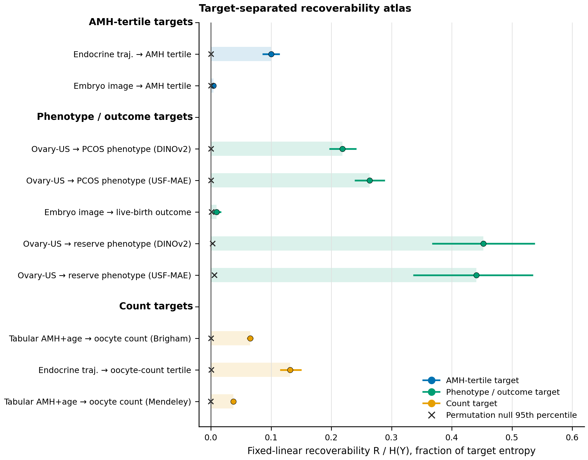
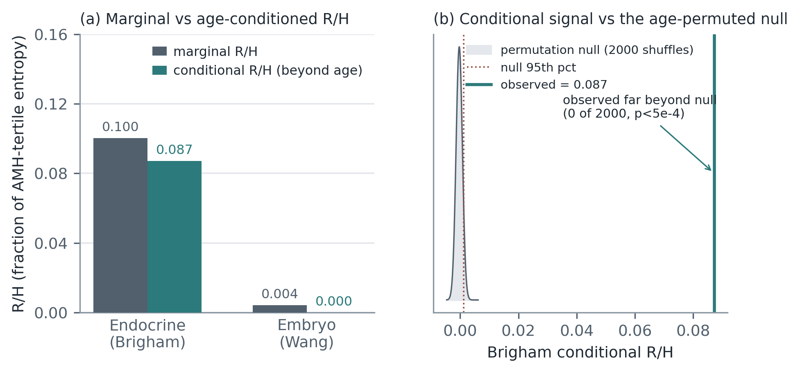
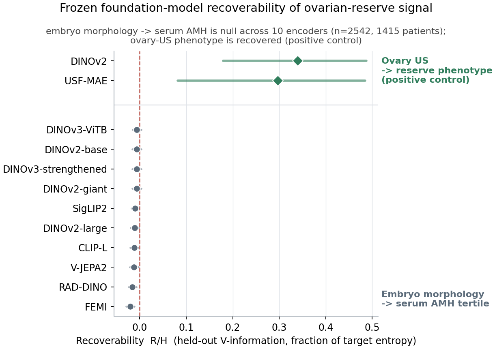
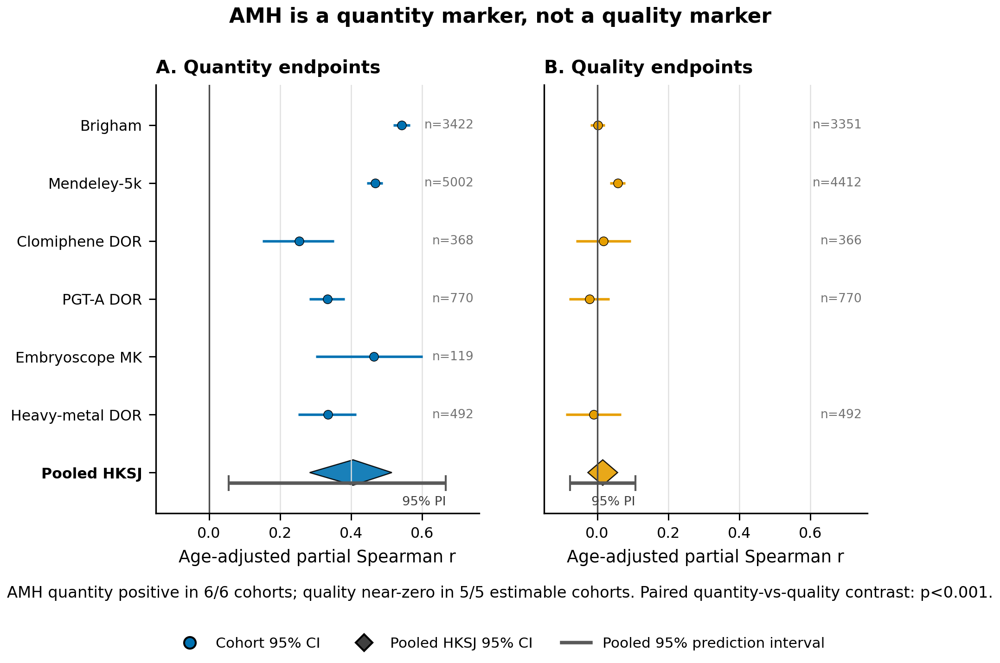

# A Target-Separated Recoverability Audit for Frozen Foundation-Model Embeddings, Demonstrated on AMH in IVF

This repository audits where AMH and ovarian-reserve information is recoverable from frozen foundation-model embeddings across public IVF-related data, including DINOv2, DINOv3, CLIP, USF-MAE, and related encoders. The analyses use predictive V-information probing, conditional age probing, control tasks, MDL summaries, and model-class sufficiency checks with TOST. The contribution is the target-separated audit protocol and the reusable `reserve_audit` package, not a new model.

<p align="center">
  <br>
  <em>Target-separated recoverability atlas. Held-out fixed-linear recoverability R/H(Y), grouped by registered target kind. Rows are never ranked across target kinds; the ovary-US phenotype node is a phenotype positive control, not an ovary-to-serum-AMH test.</em>
</p>

## Key Findings

**1. AMH-tertile recoverability depends on modality and survives age-conditioning only for endocrine trajectories.** In Brigham/Leahy endocrine trajectories, recoverability changed from marginal `R/H=0.100225` to age-conditioned `R/H=0.087189` (2000-shuffle conditional permutation `p=0.0004997501249375312`). In Wang embryo morphology it changed from marginal `R/H=0.004202` to age-conditioned `R/H=-0.000044` (`p=0.597015`).

<p align="center">
  <br>
  <em>Marginal vs age-conditioned R/H, and the Brigham conditional statistic against its 2000-shuffle age-permuted null.</em>
</p>

**2. The same frozen-encoder pipeline recovers an ovary-US phenotype positive control,** so the embryo result is a measured boundary rather than a failed pipeline check: DINOv2 `R/H=0.3401` and USF-MAE `R/H=0.2974` on FUID, while ten embryo encoders stay near zero for serum-AMH tertile.

<p align="center">
  <br>
  <em>Frozen-encoder benchmark: embryo-to-serum-AMH is null across encoders; ovary-US phenotype is recovered by the same V-information probe.</em>
</p>

**3. Clinical concordance points in the same direction.** A 6-cohort AMH meta-analysis found a quantity-marker association of `r=0.4054` (95% HKSJ CI `0.2833` to `0.5145`, `p=0.0005032429233777444`); the quality-marker pool was near zero at `r=0.0156` (95% HKSJ CI `-0.0262` to `0.0575`, `p=0.35808119845986486`). Quantity effects were positive in 6/6 cohorts; quality effects were near zero in 5/5 estimable cohorts.

<p align="center">
  <br>
  <em>AMH behaves as a quantity marker, not a per-embryo-quality marker, across IVF cohorts.</em>
</p>

These are modest aggregate effects. The age-conditioning results are single-cohort and adjust for age only. They should be read as a representation-analysis audit, not as an image-to-serum-AMH predictor.

## Repository Layout

```text
reserve_audit/              reusable audit package (registry, recoverability, sufficiency, CLI)
scripts/                    benchmark, hardening, verification, and figure generators
results/diagnostics/        aggregate diagnostic JSON files used for the public claims
figures/                    public figures generated from aggregate diagnostics
requirements.txt            minimal Python dependencies
```

## Reproducing

Install the minimal dependencies:

```bash
pip install -r requirements.txt
```

The diagnostics JSON files in `results/diagnostics/` back the numeric claims above. The encoder-benchmark figure regenerates from the aggregate benchmark JSON, and the benchmark values can be re-checked:

```bash
python scripts/make_fig_encoder_benchmark.py
python scripts/verify_benchmark.py
```

Raw cohort data and cached embeddings are not redistributed here; users should obtain those assets from their original sources and licenses. This release contains the protocol code, aggregate diagnostics, figures, and generators.

## Data

Public cohorts used by the audit include Brigham/Leahy 2021, Mendeley 5k IVF, Wang embryo-image data, FUID ovary-US, Clomiphene DOR, PGT-A euploidy DOR, Embryoscope hr-NGS KIDScore, and Heavy-metal DOR. Users should obtain each cohort from its original source.

## Scope

This is representation-analysis and probing methodology demonstrated on AMH and IVF. Image-to-serum-AMH recovery is future work gated on paired ovary-US plus continuous-AMH data, and is not claimed here. A master's thesis using this audit is in preparation.

## License

MIT (see `LICENSE`).
